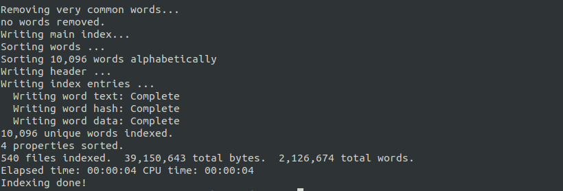
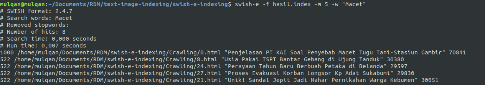
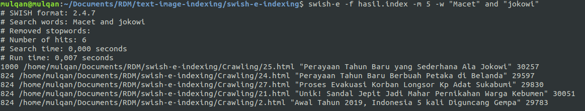
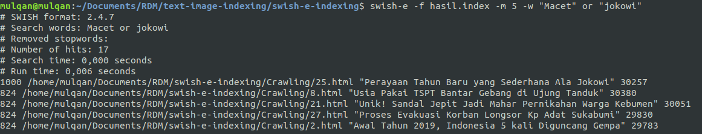
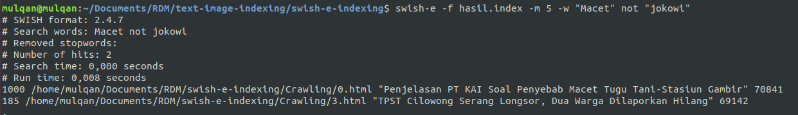
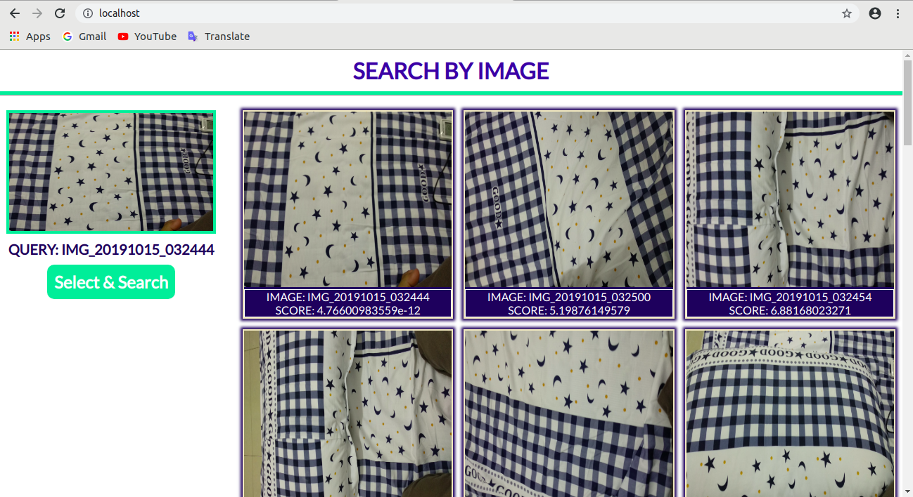

# Text and Image Indexing
Nama : Muhammad Mulqan</br>
NIM  : 1708107010043

## A. Text Indexing dengan Swish-e
Membuat indexing text

```
swish-e -c indexing.conf
```


Menguji index yang telah dibuat

```
swish-e -f hasil.index -m 5 -w “Macet”
```



```
swish-e -f hasil.index -m 5 -w “Macet” and "jokowi"
```



```
swish-e -f hasil.index -m 5 -w “Macet” or "jokowi"
```


```
swish-e -f hasil.index -m 5 -w “Macet” not "jokowi"
```


## B. Image Indexing dengan https://github.com/kudeh/image-search-engine
Menguji indexing gambar yang telah dibuat

